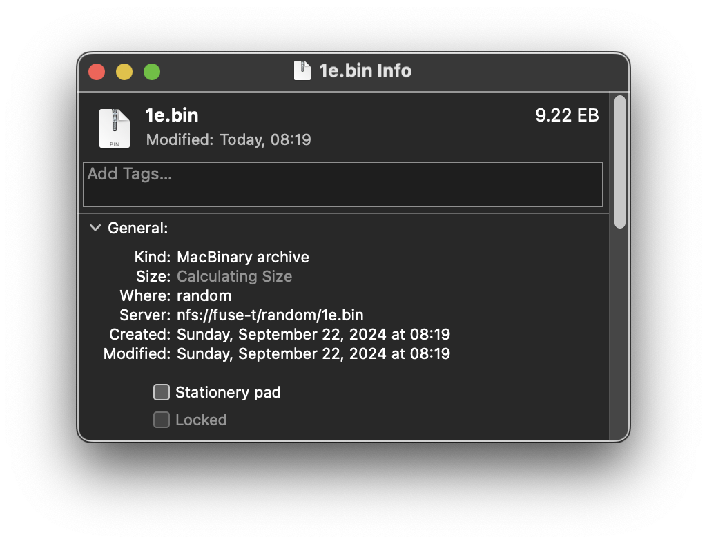

# The Random Filesystem 0.1 - pre-alpha

While /dev/random expose a random generator capable of providing an endless stream of random bytes, we cannot playback the bytes that happened before of the next ones coming ahead. This is excellent for cryptography and security but I still wanted a random device I can seek in. It will make a great demo for the NM80/QXO64 algorithm I wrote and could help me claim the trophy of the largest filesystem in the world.

The Random Filesystem exposes a series of very large files containing random data. These files can be accessed like any other files, including seeking. Behind the scene, a NM80 generator is spin up at mount and expose 2^80 bytes of adressable data. To expose that capability to the user, I wrote a proof-of-concept using libFUSE. It expose the seekable data as a series of files.

The files are generated on the fly from a 2MiB seed source. Using a combination of 8192 unique prime numbers it is possible to create a steady state of 1YiB from it.

## Theoretical limits

In theory modern, operating systems allow prgrams to seek using 64 bit integers.

This should allow us to expose files as large as 2^64 bytes. For the curious, this is 16EiB[^1] of random data. By using 65536 files to represent the different segments of 16EiB I could expose 1YiB[^2] of random data tha can be accessed in a non-sequential manner.

## Practical limits

I learned FUSE-T on the mac do not like having to call readdir many times. Everytime I try to list more than 1024 items at a time I get a never ending stream of opendir readdir releasedir calls. Apparently it is some limitations of the NFS interface used by the FUSE-T library. I did not tested this FUSE plugin on other host than FUSE-T.

To work around the problem, I decided to limit the number of files I expose to the user, as the resulting loop crashed my macbook air during testing. This should really be adressed by Apple?/FUSE-T?, not sure. I may have to file a few bug reports...

The largest reported filesize macOS can work with, despite reporting handling 64 bit offsets, is actually half of that. 0x7FFFFFFFFFFFFFFF is the maximum reported file size that does not break the operating system.

MacOS effective maximum reported file size: 9,223,372,036,854,775,807 bytes. At this point the finder cannot tell you it's size with precision but we have the 9.22 EB (8EiB) displayed in the corner and in the folder view.

To see the data in the files, I used the excellent [Hexfiend](https://hexfiend.com). The latest version of the program handles the extremely large files very well. The only complain I have is a minor display issue. The information displayed can be cut when we scroll down.

I did not find any documented mechanish to let programs know of the effective filesize limit in general. It seems to me that the upper limit of edges cases have not been tested and lack documentation.

I found a vague reference to _FILE_OFFSET_BITS that *may* be defined on some platforms in Linux [documentation](https://www.man7.org/linux/man-pages/man3/loff_t.3type.html).

As of today, macos is preventing me to expose the upper half of my files and FUSE is limiting how many of them I can expose. This makes the noise exposed to be (1/2)*(1/256) 512 times smaller than it could.

I could only list the first file and allow 65536 to be stat open and read, that would take care of the current limits of FUSE-T I experienced but I doubt it would be POSIX compliant. It is regrettable commercial operating systems providers are not providing native libFUSE implementations.

## Bugs

- State is not conserved across mounts.

## Applications

- Test the limits of operating systems's FS interfaces
- Any other application anyone can imagine

## Ideas for future development

- Present an empty FS to the user and let them create file and folders.
- Files created would be generic sequential generators like /dev/random. A naming convention of the file like Source1.aes256 would initialise a generator and expose it as a file using the proper algorith, if supported.
- Folders would hold 1YiB in many files as attempted here.

[^1]: EiB = exbibytes (1024^6) not to counfound with the metric exabyte (1000^6) [ref](https://en.wikipedia.org/wiki/Byte#Multiple-byte_units)

[^2]: YiB = yobibytes (1024^8) not to counfound with the metric yottabyte (1000^8) [ref](https://en.wikipedia.org/wiki/Byte#Multiple-byte_units)
