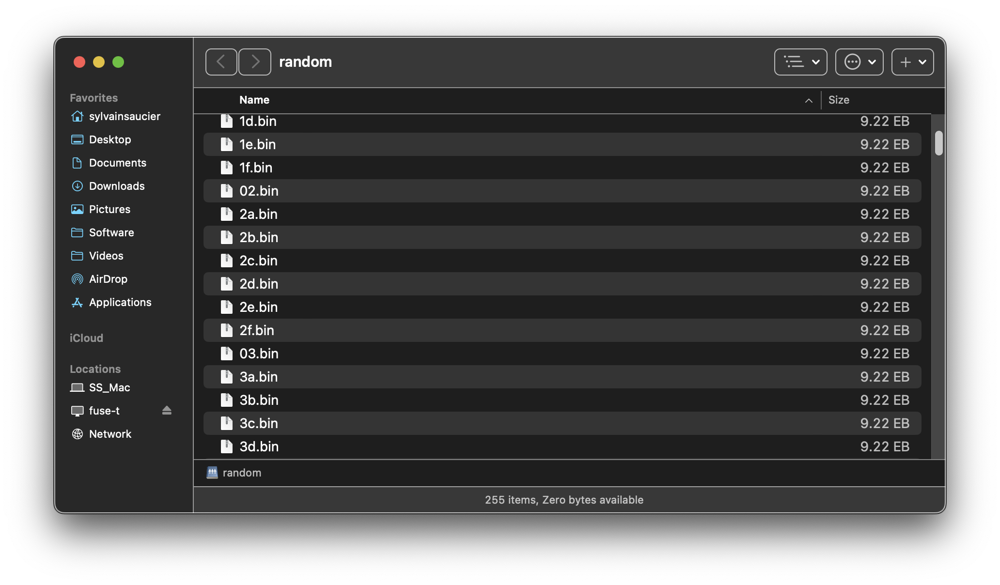
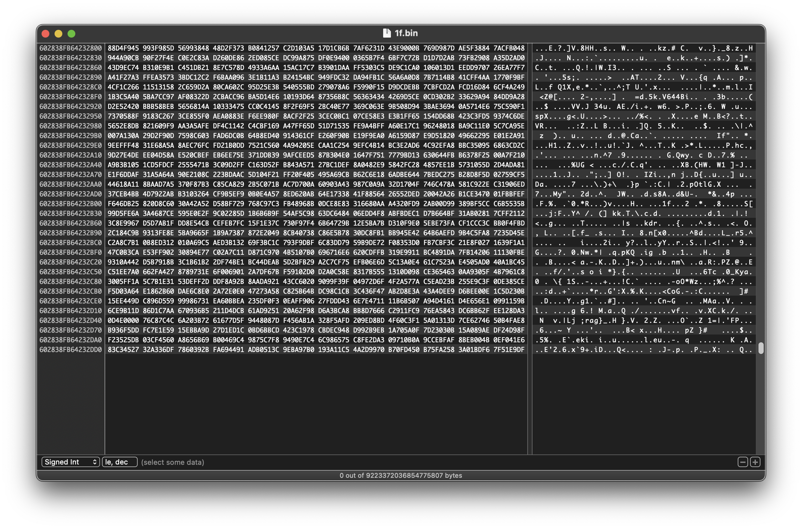
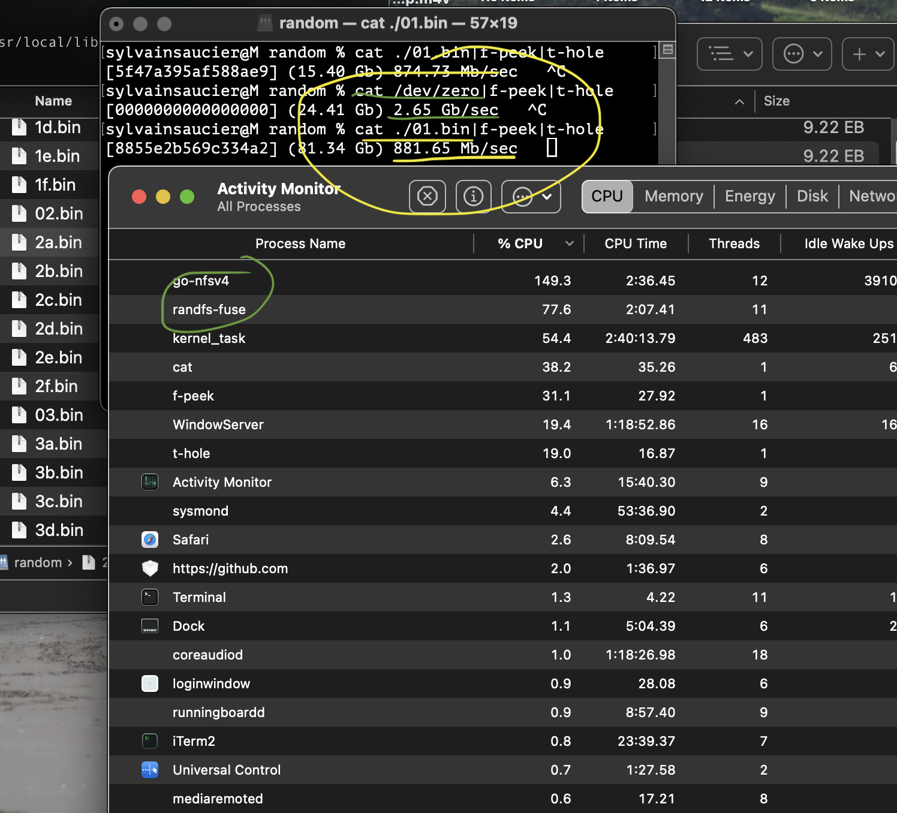
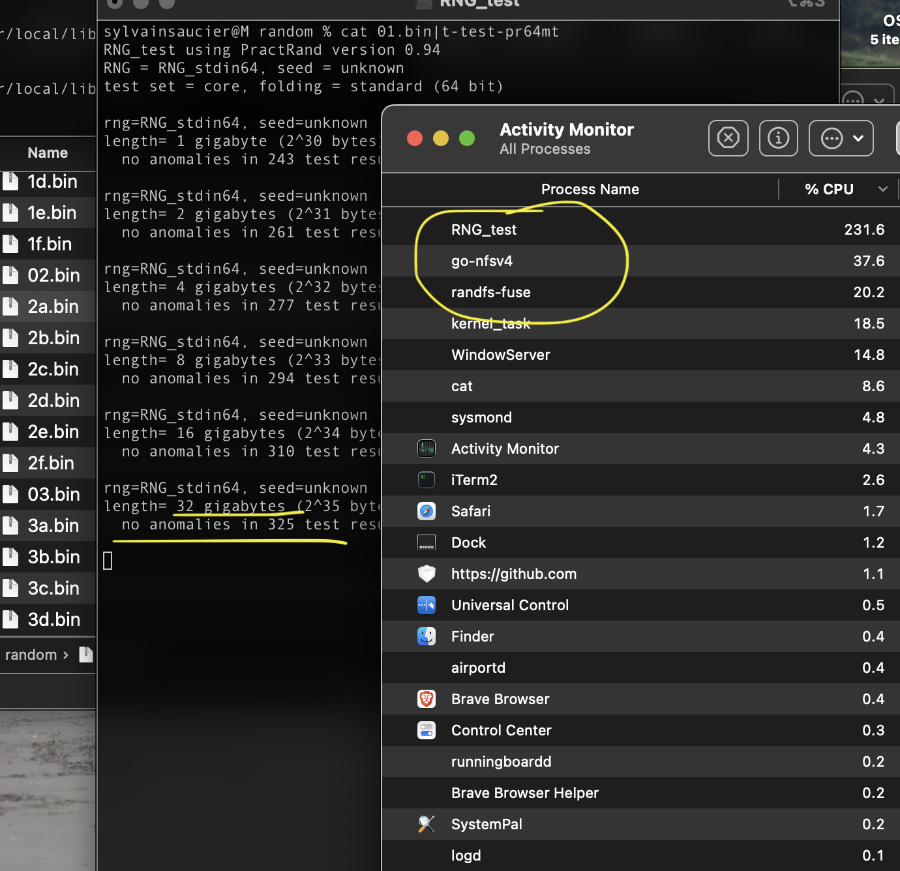

# The Random Random Filesystem

Version 0.1 - Beta

The random random filesystem contains randomly accessible random data.

In my seemingly neverending quest to understand cryptography, I created a new filesystem that expose a an algorithm I have been using for some time. Here are some of my notes and taughts as well as the state of the project.

We all know /dev/random, it offers the capability to generate a sequence one byte/block at a time. We cannot usually playback the past bytes or predict the bytes far ahead. This is excellent for cryptographic applications where secrecy is essential. 

Why try something else when we have a perfectly good solution? Because innovation is often the result of unlikely coincidences. The more ideas we try, to the more creative solutions we can find. I hope my crazy projects will be used in ways I cannot imagine.

This is at its core the NM80 algorithm. I wrote it to help me extrapolate large amount of data from a limited sample to help test a very slow generator more effectively. The resulting algorithm allow the creation of a sequence of random data of 128 EiB (134,217,728 GiB).

The data is generated by merging (xor) 4 numbers choosen according to a large prime number. By using a prime number to iterate through the data, we are guaranteed to explore all possible states and not re-encounter the same sequence within the sequence. This algorithm can generate any part of the sequence instantaneously. 

This means I can expose files containing random data that can be accessed and seeked like any other regular file. The seed is saved to disk and to allow the user to guarantee the same data is available at the same location across reboots.

2^67 is a large number. I discovered that the mac's limit to express amounts of data (wether the total amount of the volume or the amount of any file). At 1 GB/s (2^30) it would take 9,000 years to completely test one of the segment on PractRand.

The thing is, 67 is not a round number and it makes addresing weird, so i decided to pad things up by using 8192 prime numbers to bring up the address space to 2^80. The first 13 bits are used to select a unique prime number from a bank. The following 64 bits represent the block index. The last 3 bits serves to select a byte within the block.

By using 80 bytes, I create 2^80 bytes of directly addressable data. That yields exactly 1 yottabyte. I like that number. If 2^67 gave us roughly 9,000 years of random stuff, what does 2^80 means in years? 73,710,000 years.

That sector number is multiplied with the selected prime number to determine the real position within the sequence. That prime number is decomposed in 4 sub indexes of 16 bits each that select the individual components to be used. We need to ensure that most banks are changed at each turn. This avoids repetitive bit patterns that reduces the quality of the generated sequences. 

Each prime number is start as a random number. Each 16 bit sub index is brought to its next prime, then the whole number is brought to its next prime number. These numbers are generated on first access. 

This means the exact sequence is undetermined at the moment of its creation. As the user explore the differect segments, prime numbers are generated as needed and stored for future use on the hard drive to ensure the repeatability of the sequence.

What is the best way to expose the sequence to the user?

At first I tried to expose 65536 files of size 2^64. The first thing I learned is that FUSE-T do not like calling readdir 65 time in a row. Before its done another readdir hits you right away and before you know it your mac has crashed. I really need to better my understanding of the multiple readdir calls.

I exposed less files and could actually start working on my implementation. Second thing I learned, is that 64 bit OS uses signed integers to describe file size. This means I can only adress 8 EiB per files... 

To simplify things, I allowed myself to deviate from the POSIX standard and allow unlisted files to be opened and read. That allow me to use the filename as the base offset. This trick worked, I could expose a few files to give examples to the user. 

The first block, a random block, the last block and the past byte are provided as example. Any part of the sequence can be accessed by opening a file that follow this convention:

- 0x0.bin : start the segment at byte 0
- 0xffff : start the segment at byte 65535
- 0xffffffffffffffffffff : start the segment at the last addressable byte 65535

0x0123456789abcdef01234567890abcdef.bin

The file name must start with "0x" to indicate a number in hexadecimal representation. Internally, RandFS is ready for full 128 bit addressing, the 80 bit limitation comes from the underlying generator (NM80). At 80 bits this uses 2 MiB for the seed map and 64 KiB for the prime iterators. The next logical byte, 88 bits, would need 16 only MiB to store all the prime numbers used to create all the variants. 80 bits is the sweet spot for potential capacity per amount of memory consumed. 

## Theoretical limits

In theory modern, operating systems allow prgrams to seek using 64 bit integers.

This should allow us to expose files as large as 2^64 bytes. For the curious, this is 16EiB[^1] of random data. By using 65536 files to represent the different segments of 16EiB I could expose 1YiB[^2] of random data tha can be accessed in a non-sequential manner.

## Practical limits

The largest reported filesize macOS can work with, despite reporting handling 64 bit offsets, is actually half of that. 0x7FFFFFFFFFFFFFFF is the maximum reported file size that does not break the operating system.

MacOS effective maximum reported file size: 9,223,372,036,854,775,807 bytes. At this point the finder cannot tell you it's size with precision but we have the 9.22 EB (8EiB) displayed in the corner and in the folder view.

To see the data in the files, I used the excellent [Hexfiend](https://hexfiend.com). The latest version of the program handles the extremely large files very well. The only complain I have is a minor display issue. The information displayed can be cut when we scroll down. [🐞](https://github.com/HexFiend/HexFiend/issues/488)

I could only list the first file and allow 65536 to be stat open and read, that would take care of the current limits of FUSE-T I experienced but I doubt it would be POSIX compliant. It is regrettable commercial operating systems providers are not providing native libFUSE implementations. [🐜](https://github.com/macos-fuse-t/fuse-t/issues/63)

In fact, let's not report any files except for 0x0.bin and 0x0.hex and simply use the filename as base offset and the extension as the format required

## Benchmarks

The NFS implementation of FUSE-T is a bandwidth bottle neck. It eats up about half of the exêcted throughput of the underlying generator. Until MacOS give us a good native implementation of libfuse, developers will have to resort to these kind of tricks to bring FUSE to the mac platform.

Of course piping a file into a statistical test suite like PractRand yields good results. The underlying algorithms have been tested previously.

## Bugs

- Underlying algorithm passes practrand but not the stream from a file. Must investigate.

## Applications

- Test operating systems's FS interfaces
- Have files of size (2^31)-1 with real data to test extreme cases
- Replaying the "jitter" provided to an application to help diagnostic?
- Scientific applications?

## Conclusion

This solution integrates many original algorithms. It is a pleasure to provide it for free to all that needs it. The only thing I ask is to please let us know if you have a practical use for it, or a silly one, by leaving a message.

## Ideas for future development

- Present an empty FS ald let the user create file and folders.
- Files created would be generic sequential generators like /dev/random. A naming convention of the file like Source1.aes256 would initialise a generator and expose it as a file using the proper algorith, if supported.
- Each new folders would be like this filesystem and a new named 1YiB sequence.

[^1]: EiB = exbibytes (1024^6) not to counfound with the metric exabyte (1000^6) [ref](https://en.wikipedia.org/wiki/Byte#Multiple-byte_units)

[^2]: YiB = yobibytes (1024^8) not to counfound with the metric yottabyte (1000^8) [ref](https://en.wikipedia.org/wiki/Byte#Multiple-byte_units)
